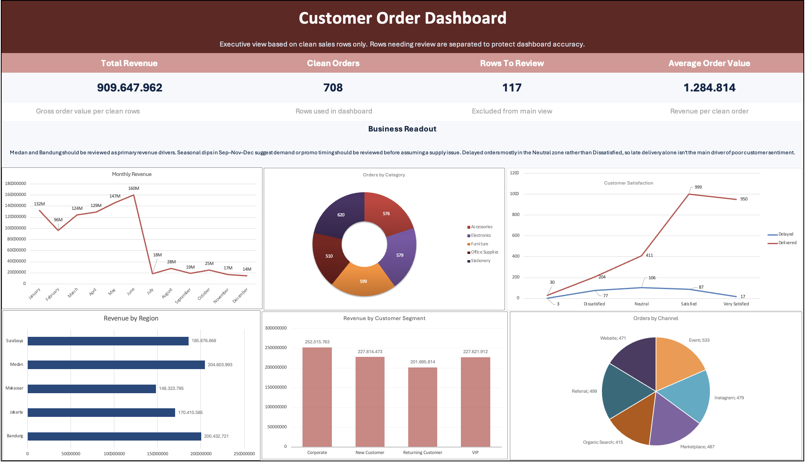

## Excel Portfolio Project
Excel portfolio project for sales data analysis

### Project Overview
This project analyzes customer order data to understand revenue drivers, order volume, and regional performance.

### Business Objective
The objective is to identify which product categories, regions, and sales channels contribute the most to clean revenue and orders, while also documenting data quality issues that should be reviewed before making dashboard-based decisions.

### Dataset
The dataset contains order-level sales records with fields such as order date, items purchased, order value, delivery status, region, category, customer segment, sales channel, and customer satisfaction rating.
The dataset includes intentional data quality issues such as missing values, duplicate transaction, and orders with cancelled or returned delivery status requiring review.

### Tools Used
* Microsoft Excel
* Excel formulas
* Summary tables
* PivotTable-style analysis
* Excel dashboard
* GitHub documentation

### Analysis Process
1. Reviewed raw order data and identified data quality issues.
2. Flagged rows with missing values, duplicate transaction, and cancelled/returned statuses for review.
3. Built a Quality Flag column to separate clean rows from rows needing review.
4. Created summary analysis for revenue, order count, average order value, and category/region/channel breakdowns.
5. Built a PivotTable to analyze customer satisfaction against delivery status.
6. Created a dashboard and documented business insights.

### Key Insights
* Total revenue reached 909.6M from 708 clean orders, with an average order value of 1.28M; 117 rows were excluded pending review.
* Revenue shows strong seasonality — January, June, and July are peak months, while September–November–December drop sharply, suggesting demand or promo timing rather than a supply issue.
* Medan and Bandung were the strongest regions by clean revenue.
* Delayed orders mostly fall in the Neutral satisfaction zone rather than Dissatisfied, indicating late delivery alone isn't the main driver of poor customer sentiment.

## Dashboard

